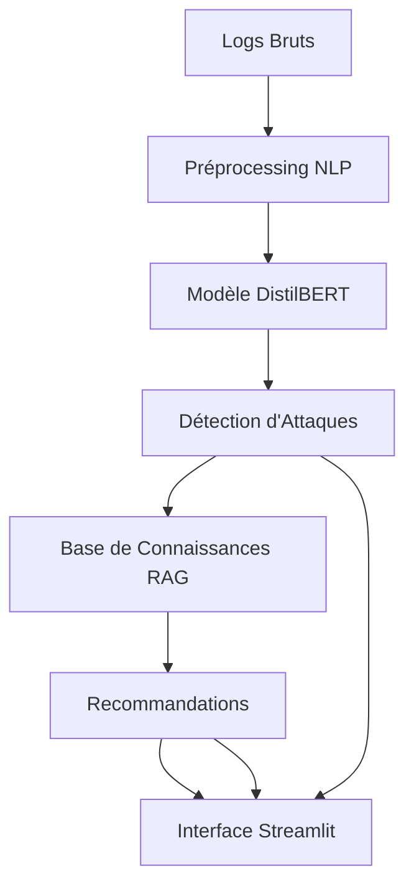

# 🛡️ CyberMentor NLP - Système de Détection et Recommandation de Cybersécurité

## 🎯 Aperçu du Projet

**CyberMentor NLP** est une plateforme intelligente de cybersécurité qui combine l'analyse de logs par IA et un système de recommandations contextuelles pour aider les analystes à détecter et contrer les cybermenaces en temps réel.

### Objectifs Principaux
- 🔍 **Détection intelligente** des attaques via l'analyse NLP des logs
- 🎯 **Recommandations contextuelles** basées sur les frameworks MITRE ATT&CK
- 📊 **Tableau de bord interactif** pour le monitoring en temps réel
- 🚀 **Déploiement containerisé** facile à installer et maintenir

## 🏗 Architecture du Système

## 📄 Licence

Distribué sous la licence MIT. Voir `LICENSE` pour plus d'informations.

**CyberMentor NLP** - Fait avec ❤️ pour la communauté cybersécurité
